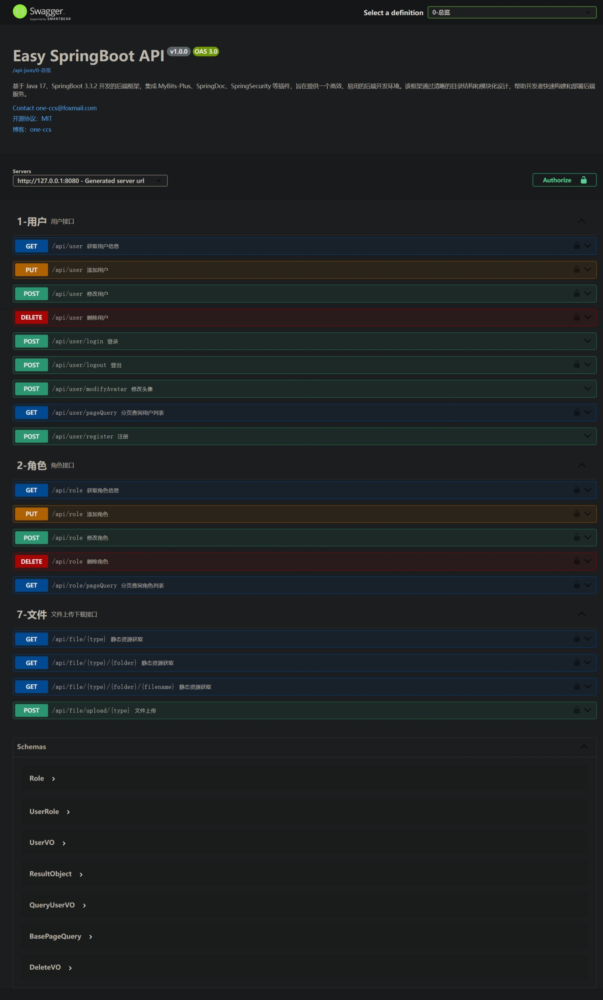

# Easy SpringBoot

基于 Java 17、SpringBoot 3.3.2 开发的后端框架，集成 MyBits-Plus、SpringDoc、SpringSecurity 等插件，旨在提供一个高效、易用的后端开发环境。该框架通过清晰的目录结构和模块化设计，帮助开发者快速构建和部署后端服务。



## 一、目录结构说明

```plaintext
project-root/
│
├─ backend/  # 后端项目目录（java 17、SpringBoot 3.3.2）
│   ├─ src/
│   |   ├─ main/
│   |   |   ├─ java/com/one_ccs/easy_spring_boot/
|   |   |   |   ├─ common/      # 公共模块
|   |   |   |   |   └─ GlobalVariable.java        # 全局变量类
|   |   |   |   |
|   |   |   |   ├─ config/      # 配置模块
|   |   |   |   |   ├─ MybatisPlusConfig.java     # MybatisPlus 配置类
|   |   |   |   |   ├─ SpringDocConfig.java       # SpringDoc 配置类
|   |   |   |   |   ├─ SpringSecurityConfig.java  # SpringSecurity 配置类
|   |   |   |   |   └─ WebConfig.java             # Web 配置类
|   |   |   |   |
|   |   |   |   ├─ controller/  # 控制器模块
|   |   |   |   |   ├─ exception/    # 异常处理模块
|   |   |   |   |   |   ├─ ErrorPageController.java   # 错误页面控制器
|   |   |   |   |   |   └─ ValidationController.java  # 参数校验控制器
|   |   |   |   |   |
|   |   |   |   |   ├─ FileController.java        # 文件上传控制器
|   |   |   |   |   ├─ *Controller.java           # 其他控制器
|   |   |   |   |   └─ ...
|   |   |   |   |
|   |   |   |   ├─ entity/      # 实体模块
|   |   |   |   |   ├─ bo/           # 业务对象
|   |   |   |   |   |   └─ MyUserBO.java          # 包含角色列表的用户类
|   |   |   |   |   |
|   |   |   |   |   ├─ dto/          # 数据传输对象
|   |   |   |   |   |   └─ MyUserDetail.java      # 用户详情类（存储当前会话用户信息，通过 JWT 解析）
|   |   |   |   |   |
|   |   |   |   |   ├─ po/           # 持久化对象
|   |   |   |   |   |   ├─ *.java                 # 实体类
|   |   |   |   |   |   └─ ...
|   |   |   |   |   |
|   |   |   |   |   ├─ vo/           # 请求/响应对象
|   |   |   |   |   |   ├─ request/               # 请求对象
|   |   |   |   |   |   |   ├─ DeleteVO.java         # 删除请求类
|   |   |   |   |   |   |   ├─ QueryUserVO.java      # 查询用户请求类
|   |   |   |   |   |   |   └─ UserVO.java           # 用户请求类
|   |   |   |   |   |   |
|   |   |   |   |   |   ├─ response/              # 响应对象
|   |   |   |   |   |   |   └─ AuthorizeVO.java      # 登录验证成功的用户信息
|   |   |   |   |   |   |
|   |   |   |   |   |   ├─ BaseData.java          # 基础数据类（用于 DTO 快速转换 VO）
|   |   |   |   |   |   ├─ BasePageQuery.java     # 基础分页查询类
|   |   |   |   |   |   ├─ BaseQuery.java         # 基础查询类
|   |   |   |   |   |   └─ Result.java            # 结果类
|   |   |   |   |   |
|   |   |   |   |
|   |   |   |   ├─ filter/      # 过滤器模块
|   |   |   |   |   ├─ CorsFilter.java            # 跨域过滤器
|   |   |   |   |   └─ JwtAuthorizeFilter.java    # JWT 授权过滤器
|   |   |   |   |
|   |   |   |   ├─ mapper/      # 映射器模块
|   |   |   |   |   └─ *Mapper.java                # 映射器接口（对应实体类）
|   |   |   |   |
|   |   |   |   ├─ service/     # 业务模块
|   |   |   |   |   ├─ impl/                     # 业务实现类
|   |   |   |   |   |   ├─ *ServiceImpl.java         # 业务实现类
|   |   |   |   |   |   └─ ...
|   |   |   |   |   |
|   |   |   |   |   └─ I*Service.java             # 业务接口类
|   |   |   |   |
|   |   |   |   ├─ util/        # 工具模块
|   |   |   |   |   ├─ annotation/                # 注解模块
|   |   |   |   |   |   └─ AnonymousAuth.java         # 匿名访问注解（用于不需要登录的接口）
|   |   |   |   |   |
|   |   |   |   |   ├─ FileUtil.java              # 文件工具类
|   |   |   |   |   ├─ JwtUtil.java               # JWT 工具类
|   |   |   |   |   └─ MyBatisPlusGenerator.java  # MybatisPlus 代码生成器
|   |   |   |   |
|   |   |   |   └─ EasySpringBootApplication.java  # 启动类
|   |   |   |
|   |   |   ├─ resources/  # 资源文件目录
|   |   |   |   ├─ mapper/      # 映射器配置文件目录
|   |   |   |   |   └─ *Mapper.xml                # 映射器配置文件
|   |   |   |   |
|   |   |   |   └─ application.yml  # SpringBoot 配置文件
|   |   |   |
|   |   |
|   |
│   └─ ...
│
├─ frontend/ # 前端项目目录
│   ├─ ...
│
├─ license   # MIT 开源协议
├─ readme.md # 工程自述
└─ ...
```


## 二、部署

1. 安装依赖
2. （可选）修改 `MyBatisPlusGenerator.java` 配置并运行，生成实体相关代码替换项目中的对应文件
3. 修改 `application.yaml` 配置文件，配置数据库连接信息
4. 启动项目
